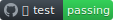
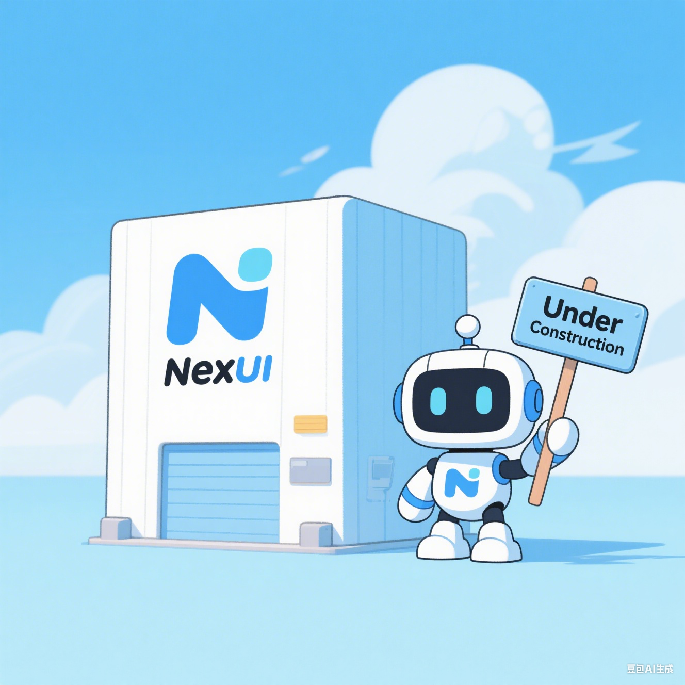

  

    
  

  
# Nex UI

🎉 A beautiful, modern, and reliable React component library.

Theme Customizable, Light & Dark UI, Unique DX, Written In TypeScript

 

## Documentation

Visit https://nex-ui-docs.vercel.app to view the full documentation.

## Getting Started

Visit https://nex-ui-docs.vercel.app/docs/getting-started to get started with Nex UI.

## Storybook

Visit https://nex-ui-storybook.vercel.app to view the storybook for all components.

## Contributing

Contributions are always welcome!

See [CONTRIBUTING.md](/CONTRIBUTING.md) for ways to get started.

Please adhere to this project's [CODE_OF_CONDUCT](/CODE_OF_CONDUCT.md).

## License

[MIT](https://choosealicense.com/licenses/mit/)

## UNDER CONSTRUCTION

Right now there is no stable version available for this library. We're just working on it. 🚀

